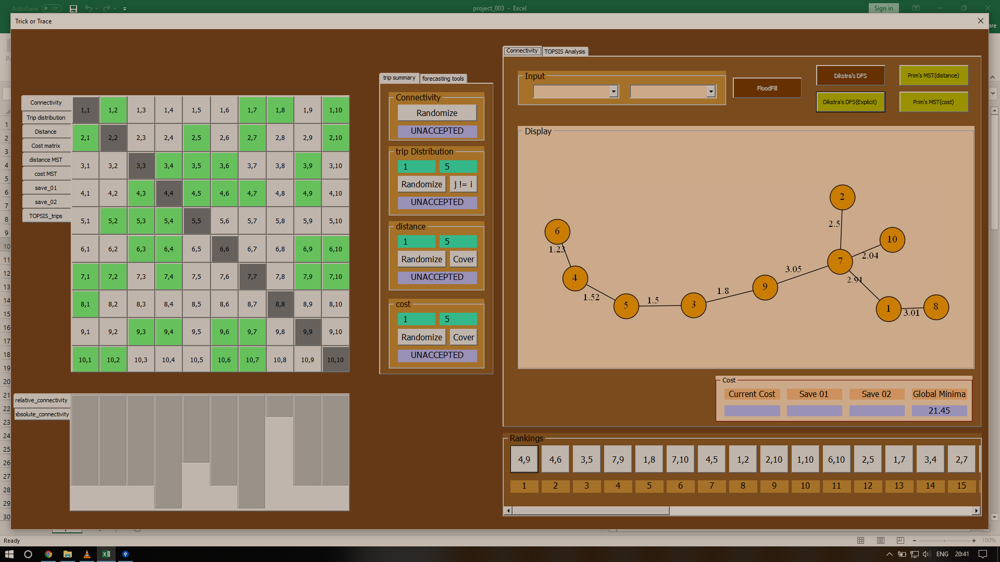
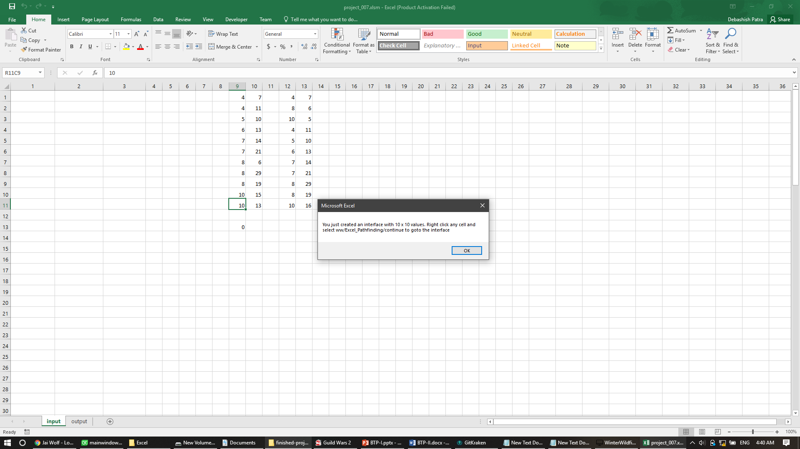
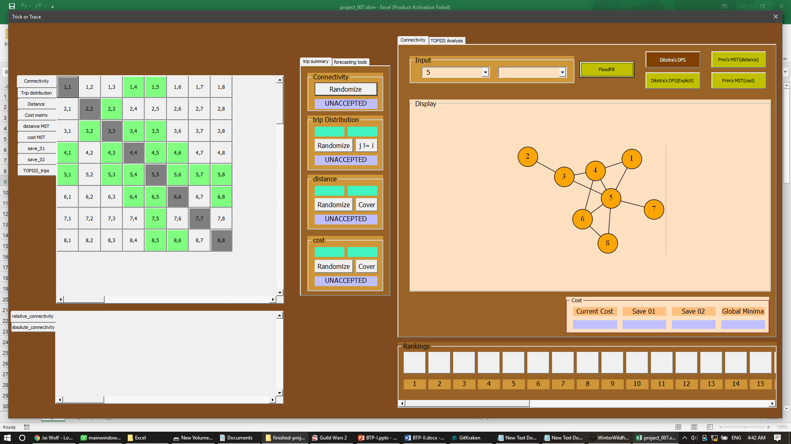

My Contribution

I created a graph algorithm visualizer for excel, as an educational tool. This was my first B.Tech project, completed over a period of three months.

The following image was the Excel VBA app I built.

### About

As a civil engineering undergrad, understanding graph algorithms was an essential part of my coursework.

Combined with that, a passion to build something visual and appealing, I undertook designing this app for my first B.Tech project.

Problem Statement

**Visulize the following algorithms in Excel:**

- BFS, DFS
- Road Connectivity Matrix
- Prim's MST

**Provide input options for the following metrics (edge weights):**

- trip distribution (tab 2, assymetrical)
- distance (tab 2, symmetrical)
- cost (tab 3, assymetrical)

**Features like:**

- populating with random data
- bar chart visuzlizer
- nearest/farthest element (when distance matrix given)

**Solve implementation challenges like:**

- graphviz (helped generate theimage on right panel)
- various batch scripts, which pre-processed the xcel sheets and generated the payload for graphviz

### Usage

You right click on an integer cell, and the tool with open the GUI playground for you.

For DFS, BFS etc. (which expect an origin node), you may select such from the dropdown and click the asociated button.

